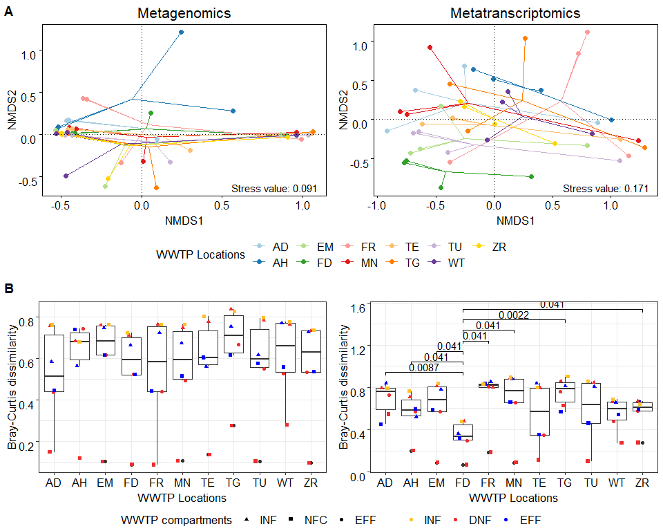

Comparing microbial communities between WWTP locations to identify
outliers
================
Jule Freudenthal
2021-12-10

**R version:** 3.6.2 (2019-12-12), Dark and Stormy Night  
**Packages**

-   docstring v. 1.0.0
-   dplyr v. 1.0.7  
-   ggplot2 v. 3.3.5  
-   ggpubr v. 0.4.0
-   rlist v. 0.4.6.1
-   rprojroot v. 2.0.2

``` r
# Load packages
library(docstring)
library(dplyr)
library(ggplot2)
library(ggpubr)
library(rlist)

# Load functions
source("./Functions/beta.diversity.R")
source("./Functions/calculate.NMDS.R")
source("./Functions/style.sheet.R")
```

Considering that we analyze WWTPs at different locations, each affected
by location-specific environmental and operational factors, we can not
necessarily treat the locations as biological replicates. Therefore, we
screen the data for potential outliers by comparing the microbial
communities of the different WWTP locations. We

1.  Analyze the multivariate dispersion of the WWTP locations visualized
    by non-metric multidimensional scaling (NMDS) based on Bray-Curtis
    dissimilarity (function metaMDS, package vegan).  
2.  Analyze the beta diversity of the WWTP locations based on
    Bray-Curtis dissimilarity (function vegdist, package vegan) and
    identify significant differences between two WWTP locations,
    respectively, using unpaired two-sample Wilcoxon tests (function
    stat\_compare\_means, package ggpubr).

# 01 Normalize data

We calculate the Bray-Curtis dissimilarity from the relative abundance
data, i.e., the number of reads of each taxon divided by the total
number of reads of the respective sample. Also, we exclude technical
replicates (see [Assessment of the variation caused by sampling
processing (sequencing)](03_VariationsCausedBySampleProcessing.md)) from
the data set.

``` r
# Load table with names of preprocessed count tables
filenames_count_tables <- read.table("./R/Lists/Preprocessing_data.csv", header = TRUE, 
                                     row.names = 1, sep = ";", colClasses = "character")

# Create open list for normalized count data
normalized_count_tables <- list()

# Loop iterates over the data types (DNA/RNA data)
for(data_type in c("DNA", "RNA")){
  
  # Load count table and metadata
  count_table <- read.table(paste0("./DataToAnalyse/PreprocessedData/", data_type, "_" , 
                                   filenames_count_tables[5,]), 
                            header = TRUE, sep = ";", dec = ".", row.names = 1)

  # Delete ZR.R2 and ZR.R3 replicates 
  count_table <- count_table[,!grepl("ZR.R2|ZR.R3", colnames(count_table))]
  colnames(count_table) <- gsub("ZR.R1", "ZR", colnames(count_table))

  # Extract count data 
  counts <- select_if(count_table, is.numeric)

  # Normalize counts (relative counts)
  normalized_counts <- sweep(x = counts, MARGIN = 2, STATS = colSums(counts), FUN = '/')

  # Save abundance in the list
  normalized_count_tables <- list.append(normalized_count_tables, normalized_counts)
}

# Names list
names(normalized_count_tables) <- c("DNA", "RNA")
```

# 02 Multivariate dispersion

``` r
# Define colors per location
colors_locations <-c("#A6CEE3","#1F78B4","#B2DF8A","#33A02C","#FB9A99","#E31A1C",
         "#FDBF6F","#FF7F00","#CAB2D6","#6A3D9A","gold")

# Create open list for plots
multivariate_dispersion <- list()

# Loop iterates over the data types (DNA/RNA data)
for(data_type in c("DNA", "RNA")){

  # Calculate NMDS
  NMDS <-  calculate.NMDS(normalized_count_tables[[data_type]])

  # Create table for visualization, add column specifying the locations
  plot_table <- cbind(NMDS$Eigenvectors, Location=gsub("_.*", "", 
                                                       rownames(NMDS$Eigenvectors)))
  
  # Calculate center points
  center_points <- aggregate(cbind(NMDS1, NMDS2) ~ Location, data = plot_table, FUN = mean)
  
  # Merge plot table and center points
  plot_table <- merge(plot_table, setNames(center_points, c('Location','NMDS_1','NMDS_2')), 
                      by = 'Location', sort = FALSE)
  
  # Visualization
  plot <- ggplot(plot_table, aes(x = NMDS1, y = NMDS2, color = Location)) +  
    geom_segment(mapping = aes(xend = NMDS_1, yend = NMDS_2)) +
    geom_point(size=2) + 
    geom_hline(yintercept = 0, colour="black", linetype="dotted") +
    geom_vline(xintercept = 0, colour="black", linetype="dotted") +
    theme_linedraw()+
    theme(panel.grid.major = element_blank(), 
          panel.grid.minor = element_blank())

  # Adjust plot
  ifelse(data_type == "DNA", title <- "Metagenomics", title <- "Metatranscriptomics")
  plot <- style.sheet(plot, colors = colors_locations, 
                      plot.title = title, legend.position = "bottom",
                      legend.title.by.color = "WWTP Locations")
  
  # Add stress value and change number of rows for legend
  plot <- plot + annotate("text", x=Inf,y=-Inf,hjust=1.1,vjust=-0.5,
                          label=paste("Stress value:", round(NMDS$StressValue,3))) + 
                 guides(col=guide_legend(nrow = 2, byrow = F))

  # Save the plot in the list
  multivariate_dispersion <- list.append(multivariate_dispersion, plot)
}

# Arrange plots, extract legend
multivariate_dispersion_legend <- as_ggplot(get_legend(multivariate_dispersion[[1]]))
multivariate_dispersion <- ggarrange(plotlist=multivariate_dispersion, ncol = 2, nrow = 1, 
                                     legend = "none")
```

# 03 Beta diversity and unpaired two-sample Wilcoxon test

``` r
# Create vectors specifying the sample places and define colors per sample place
sample_places <- c("INF","DNF","NFC","EFF")
colors_sample_places <- c("goldenrod1", "firebrick2", "forestgreen", "blue")

# Create open list for plots
beta_diversity <- list()

# Loop iterates over the data types (DNA/RNA data)
for(data_type in c("DNA", "RNA")){

  # Extract normalized counts
  normalized_counts <- normalized_count_tables[[data_type]]

  # Create metadata with columns for sample places and locations
  metadata <- data.frame(Location=gsub("_.*", "", colnames(normalized_counts)), 
                         Sample_places=gsub(".*_", "", colnames(normalized_counts)))
  rownames(metadata) <- colnames(normalized_counts)

  # Calculate and visualize beta diversity, 
  # Test for differences using the unpaired two-sample Wilcoxon test
  plot <- beta.diversity(counts = normalized_counts, metadata = metadata, groups = "Location", 
                         colored = "Sample_places", shaped = "Sample_places", normalize = F)

  # Adjust plot
  ifelse(data_type == "DNA", title <- "Metagenomics", title <- "Metatranscriptomics")
  plot <- style.sheet(plot, colors = colors_sample_places, legend.title.by.color = "", 
                      legend.position = "bottom", legend.title.by.shape = "WWTP compartments", 
                      x.axis.label = "WWTP Locations", 
                      legend.text.by.color.order = sample_places, 
                      legend.text.by.shape.order = sample_places, plot.title = "")

  # Save the plot in the list
  beta_diversity <- list.append(beta_diversity, plot)
}

# Arrange plots, extract legend
beta_diversity_legend <- as_ggplot(get_legend(beta_diversity[[1]]))
beta_diversity <- ggarrange(plotlist=beta_diversity, ncol = 2, nrow = 1, legend = "none")
```

# 04 Arrange figures

``` r
# Arrange plots and legends
plot <- ggarrange(plotlist=list(multivariate_dispersion, multivariate_dispersion_legend, 
                                beta_diversity, beta_diversity_legend),
                  ncol = 1, nrow = 4, labels = c("A", "", "B", ""),heights = c(1, 0.2, 1, 0.1))
print(plot)
```



Graphs showing multivariate dispersion **(A)** and beta diversity
**(B)** of microbial community composition at N=11 WWTP locations, based
on metagenomic data (left-hand side) and metatranscriptomic data
(right-hand side). For multivariate dispersion **(A)**, the lines
(color-coded by location) link samples at each location to their
centromere. For beta diversity **(B)**, boxplots show the 25 % and 75 %
percentiles and medians of Bray-Curtis dissimilarities. Points are color
and symbol-coded by WWTP compartments. In beta diversity based on
metatranscriptomic data (lower row, right-hand side), significant
differences between location **FD** and the other locations are
indicated (unpaired two-sample Wilcoxon test). **Based on these results,
location FD was excluded from further analysis**.
