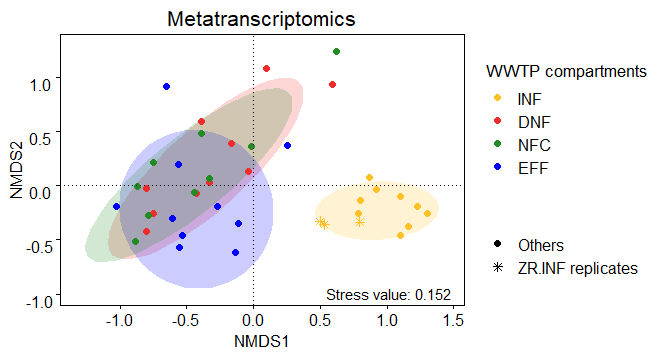

Assessment of the variation caused by sampling processing (sequencing)
================
Jule Freudenthal
2021-12-10

**R version:** 3.6.2 (2019-12-12), Dark and Stormy Night  
**Packages**

-   docstring v. 1.0.0
-   dplyr v. 1.0.7  
-   ggplot2 v. 3.3.5

``` r
# Load packages
library(docstring)
library(dplyr)
library(ggplot2)

# Load functions
source("./Functions/calculate.NMDS.R")
source("./Functions/plot.NMDS.R")
source("./Functions/style.sheet.R")
```

We evaluate the variation caused by sample processing, i.e. sequencing,
based on an non-metric multidimensional scaling (NMDS) plot made with
relative abundance data, i.e., the number of reads of each taxon divided
by the total number of reads of the respective sample, transformed by
Bray-Curtis dissimilarity.

``` r
# Load table with names of preprocessed count tables
filenames_count_tables <- read.table("./R/Lists/Preprocessing_data.csv", header = TRUE, 
                                     row.names = 1, sep = ";", colClasses = "character")

# Load count table and metadata
count_table <- read.table(paste0("./DataToAnalyse/PreprocessedData/RNA_" , 
                                 filenames_count_tables[7,]), 
                          header = TRUE, sep = ";", dec = ".", row.names = 1)
metadata <- read.table("./DataToAnalyse/Metadata/Metadata_RNA.csv", 
                       header = TRUE, sep = ";", dec = ".", row.names = 1)

# Extract count data 
counts <- select_if(count_table, is.numeric)

# Normalize counts (relative counts)
normalized_counts <- sweep(x = counts, MARGIN = 2, STATS = colSums(counts), FUN = '/')

# Create new column to differ between replicates and other samples
metadata$Cluster_variable <- "Others"
metadata$Cluster_variable[grepl("\\.",metadata$Location)] <- "ZR.INF replicates"
metadata$Cluster_variable <- as.factor(metadata$Cluster_variable)

# Order rows of metadata, they must match the columns of the count data
metadata <- metadata[match(colnames(normalized_counts), rownames(metadata)),]

# Calculate ordination
NMDS <- calculate.NMDS(normalized_counts) 

# Visualization
plot <- plot.NMDS(NMDS$Eigenvectors, group.attrib = metadata$Sample_Place, 
                  cluster.attrib = metadata$Cluster_variable, point.size = 2, 
                  draw.ellipse.by = "Group")

# Create vectors specifying the sample places and define colors per sample place
sample_places <- c("INF","DNF","NFC","EFF")
colors_sample_places <- c("goldenrod1", "firebrick2", "forestgreen", "blue")

# Adjust plot
plot <- style.sheet(plot, colors = colors_sample_places, fill.colors = colors_sample_places, 
                    fill.colors.opacity = 0.2, legend.text.by.color.order = sample_places, 
                    legend.title.by.color = "WWTP compartments", legend.title.by.shape = "", 
                    legend.text.by.fill.order = sample_places, point.shapes = c(16,8), 
                    plot.title = "Metatranscriptomics")

# Add stress value
plot <- plot + annotate("text", x=Inf,y=-Inf,hjust=1.1,vjust=-0.5,
                        label=paste("Stress value:", round(NMDS$StressValue,3)))
print(plot)
```



The variation caused by sample processing is shown for one location,
“ZR”, showing three sequencing replicates from the inflow (INF)
(replicates indicated by yellow asterisks). Based on this comparison, we
concluded that **variation caused by sequencing was low**. Thus, we keep
only one of the three replicates for the remainder of our analyses, to
ensure comparability with the single samples taken from the other
compartments at the different WWTP locations.
