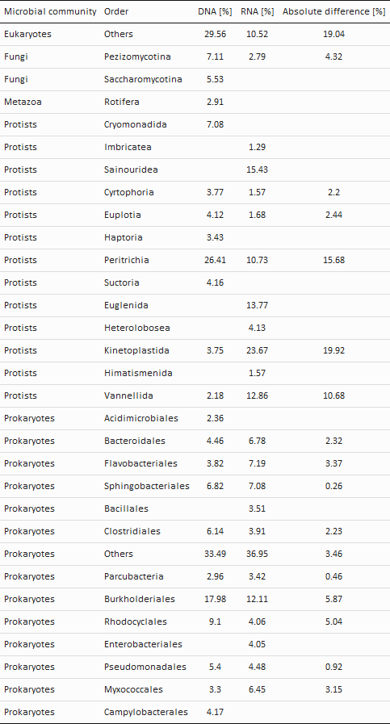

```{r setup, include=FALSE}
knitr::opts_chunk$set(echo = TRUE)

# Set global working directory
knitr::opts_knit$set(root.dir = rprojroot::find_rstudio_root_file())
```

**R version:** 3.6.2 (2019-12-12), Dark and Stormy Night  
**Packages**

* docstring v. 1.0.0 
* dplyr v. 1.0.7  
* ggpubr v. 0.4.0  
* kableExtra v. 1.3.4  
* mgsub v. 1.7.2  
* rlist v. 0.4.6.1  
* tidyr v. 1.1.3  

```{r, message=FALSE, warning=FALSE, results='hide', echo=FALSE}
# Install packages
if (!require("docstring")) install.packages("docstring")
if (!require("dplyr")) install.packages("dplyr")
if (!require("ggpubr")) install.packages("ggpubr")
if (!require("kableExtra")) install.packages("kableExtra")
if (!require("mgsub")) install.packages("mgsub")
if (!require("rlist")) install.packages("rlist")
if (!require("tidyr")) install.packages("tidyr")
```
```{r message=FALSE, warning=FALSE}
# Load packages
library(docstring)
library(dplyr)
library(ggpubr)
library(kableExtra)
library(mgsub)
library(rlist)
library(tidyr)

# Load functions
source("./Functions/line.area.plot.transformation.R")
source("./Functions/line.area.plot.R")
source("./Functions/style.sheet.R")
```

To analyze microbial community changes across wastewater treatment compartments, we compute area plots of the 11 most abundant prokaryotic and eukaryotic orders, including both free-living and parasitic. 

# 01 Data transformation  

```{r, warning=FALSE, message=FALSE}
# Create vectors specifying the sample places and define colors per sample place
sample_places <- c("INF","DNF","NFC","EFF")

# Create open list for transformed data
area_plot_tables <- list()

# Loop iterates over the data types (DNA/RNA data) 
for(data_type in c("DNA", "RNA")){
  
  # Load count- and meta- and taxonomy data
  load(paste0("./DataToAnalyse/RData/", data_type, "_data.rds"))
  
  # Rename the phylogenetic group 'Order'
  taxonomy$Order <- gsub("_X*", "", taxonomy$Order)
  
  # Check if row names of taxonomy and count data match
  if(!identical(rownames(taxonomy), rownames(counts))){
    stop("Row names of taxonomy and counts must match")
  }
  
  # Subset table for prokaryotes and eukaryotes
  count_tables <- lapply(c("SILVA", "PR2"), function(x) counts[taxonomy$Database == x,])
  taxonomy_tables <- lapply(c("SILVA", "PR2"), function(x) taxonomy[taxonomy$Database == x,])
  names(count_tables) <- c("Prokaryotes", "Eukaryotes")
  names(taxonomy_tables) <- c("Prokaryotes", "Eukaryotes")

  # Create open lists 
  tables_order <- list()
  tables_traits <- list()
  
  # Loop iterates over the microbial communities (prokaryotes/eukaryotes) 
  for(microbial_community in c("Prokaryotes", "Eukaryotes")){

    # Extract count and taxonomy table
    counts <- count_tables[[microbial_community]]
    taxonomy <- taxonomy_tables[[microbial_community]]

    # Normalize counts (relative counts)
    normalized_counts <- sweep(x = counts, MARGIN = 2, STATS = colSums(counts), FUN = '/')*100

    # While the transformation, the names of the taxa are ordered alphabetically
    # The taxa shall also be ordered by Phylum and Order, 
    # Thus we add a column combining Phylum and Order
    # For Proteobacteria, the class is also included 
    # alpha, beta, gamma, delta and epsilon are replaced with A-E
    taxonomy$Order <- paste(taxonomy$Phylum, taxonomy$Class, taxonomy$Order, sep = "--")
    taxonomy$Order[!grepl("Proteobacteria",taxonomy$Order)] <- 
      gsub("--.*--", "--", taxonomy$Order[!grepl("Proteobacteria",taxonomy$Order)])
    taxonomy$Order <- mgsub(taxonomy$Order, c("--Alpha.*--", "--Beta.*--", "--Gamma.*--",
                                              "--Delta.*--", "--Epsilon.*--"),
                          c("--A--", "--B--", "--C--", "--D--", "--E--"))
    
    # Order rows of metadata, they must match the columns of the abundance data
    metadata <- metadata[match(colnames(normalized_counts), rownames(metadata)),]

    # Transform data
    table_order <- line.area.plot.transformation(counts = normalized_counts, metadata = metadata,
                                                 taxonomy = taxonomy, x.axis = "Sample_Place",
                                                 x.axis.order = sample_places, 
                                                 fill.factor = "Order", fill.levels = 11)
    table_traits <- line.area.plot.transformation(counts = normalized_counts, metadata = metadata,
                                                 taxonomy = taxonomy, x.axis = "Sample_Place",
                                                 x.axis.order = sample_places, fill.factor = "Traits")
    
    # Assign colors to traits
    table_traits$Colors <- ifelse(table_traits$Traits == "free-living", "#2166AC", "#D53E4F")
    
    # Save table in the list
    tables_order <- list.append(tables_order, table_order)
    tables_traits <- list.append(tables_traits, table_traits)
  }
  # Name lists
  names(tables_order) <- c("Prokaryotes", "Eukaryotes")
  names(tables_traits) <- c("Prokaryotes", "Eukaryotes")
  
  # Merge both lists
  area_plot_tables <- list.append(area_plot_tables, 
                                  Map(list, Order=tables_order, Traits=tables_traits))
}

# Name list
names(area_plot_tables) <- c("DNA", "RNA")
```
```{r, echo=FALSE}
rm(list = setdiff(ls(), c("area_plot_tables", "line.area.plot", "style.sheet")))
```

# 02 Overview of most abundant orders in WWTPs.

```{r, message=FALSE}
# Create open table
table_overview_taxa <- setNames(data.frame(matrix(ncol = 2, nrow = 0)),
                                c("Order","Database"))

# Loop iterates over the data types (DNA/RNA data) 
for(data_type in c("DNA", "RNA")){
  # Extract Pro- and Eukaryote data
  Prokaryotes <- area_plot_tables[[data_type]][["Prokaryotes"]][["Order"]]
  Eukaryotes <- area_plot_tables[[data_type]][["Eukaryotes"]][["Order"]]
  
  # Assign database
  Prokaryotes$Database <- "SILVA"
  Eukaryotes$Database <- "PR2"
  
  # Merge Pro- and Eukaryote data data
  table <- merge(Prokaryotes[,c("Order", "Database", "Mean")], 
                 Eukaryotes[,c("Order", "Database", "Mean")],all=T)
  
  # Sum 'Mean' by Order and Database
  # Divide each value by 4 to get 100% for prokaryotes and eukaryotes respectively
  table <- table %>% group_by(Order,Database) %>% summarise(sum(Mean))
  table$`sum(Mean)` <- round(table$`sum(Mean)`/4,2)
  colnames(table)[colnames(table) == "sum(Mean)"] <- paste(data_type, "[%]")
  
  # Merge table with 'table_overview_taxa'
  table_overview_taxa <- merge(table_overview_taxa, table, by=c("Order","Database"), all = T)
}

# Assign microbial community
table_overview_taxa$'Microbial community' <- "Protists"
table_overview_taxa[table_overview_taxa$Order == "Others" & table_overview_taxa$Database == "PR2", 
                    "Microbial community"] <- "Eukaryotes"
table_overview_taxa[table_overview_taxa$Database == "SILVA", "Microbial community"] <- "Prokaryotes"
table_overview_taxa[grepl("Metazoa",table_overview_taxa$Order), "Microbial community"] <- "Metazoa"
table_overview_taxa[grepl("Fungi",table_overview_taxa$Order),"Microbial community"] <- "Fungi"

# Re-order data
table_overview_taxa <- table_overview_taxa[order(table_overview_taxa$Database, 
                                                 table_overview_taxa$`Microbial community`),]

# Remove Phylum and Class from taxa name
table_overview_taxa$Order  <- gsub(".*--", "", table_overview_taxa$Order)

# Absolute Difference
table_overview_taxa$"Absolute difference [%]" <- 
  abs(table_overview_taxa$`DNA [%]` - table_overview_taxa$`RNA [%]`)

# Replace NAs and delete row names
table_overview_taxa[is.na(table_overview_taxa)] <- ""
rownames(table_overview_taxa) <- NULL

# Visualise table
kable(table_overview_taxa[,c("Microbial community","Order","DNA [%]", "RNA [%]",
                             "Absolute difference [%]")], 
      booktabs = TRUE, align = "llccc") %>%
  kable_classic(full_width = F, html_font = "Calibri")  %>%
  kable_styling(font_size = 12, bootstrap_options = "condensed", 
                position = "center", latex_options = "scale_down")%>%
  save_kable("./R/Tables/MicrobialCommunityComposition.png") 
```
```{r, echo=FALSE}
rm(list = setdiff(ls(), c("area_plot_tables", "line.area.plot", "style.sheet")))
```



# 03 Colors

The colors are assigned to the orders across DNA and RNA data, i.e. an order that occurs in both DNA and RNA  data sets will have the same color.
```{r, warning=FALSE, results='hide', message=FALSE}
# Define colors for pro- and eukaryotes
color_prokaryotes <- c("#762A83", "#bd0026", "#f03b20", "#fd8d3c","#fecc5c", "#ffffb2",
                       "gray75","#7FBC41", "#1B7837", "#313695", "#4575B4", "#ABD9E9",
                       "#E0F3F8", "#F1B6DA")

color_eukaryotes <- c("#E7D4E8", "#9970AB", "#762A83", "#bd0026", "#f03b20", "#fd8d3c",
                      "#fecc5c", "#ffffb2","#7FBC41", "#1B7837","#00441B", "#313695", 
                      "#4575B4", "#BF812D", "#8C510A", "gray75", "#F1B6DA")

# Loop iterates over the microbial communities (prokaryotes/eukaryotes) 
for(microbial_community in c("Prokaryotes", "Eukaryotes")){
 
  # Merge DNA and RNA data
  merged_data <- rbind(area_plot_tables[["DNA"]][[microbial_community]][["Order"]], 
                       area_plot_tables[["RNA"]][[microbial_community]][["Order"]])

  # Unique the taxa names, sort them, set "Others" at last position 
  taxa <- data.frame(Order=c(sort(unique(merged_data$Order)
                                  [unique(merged_data$Order) != "Others"]), "Others"))
  
  # Assign colors to orders
  ifelse(microbial_community=="Prokaryotes", taxa$Colors <- color_prokaryotes,
         taxa$Colors <- color_eukaryotes)
  DNA <- merge(area_plot_tables[["DNA"]][[microbial_community]][["Order"]], taxa, 
               by = "Order")
  RNA <- merge(area_plot_tables[["RNA"]][[microbial_community]][["Order"]], taxa, 
               by = "Order")
  
  # Remove Phylum and Class from taxa name
  DNA$Order <- gsub(".*--", "", DNA$Order)
  RNA$Order <- gsub(".*--", "", RNA$Order)

  # Save tables in list
  area_plot_tables[["DNA"]][[microbial_community]][["Order"]] <- DNA
  area_plot_tables[["RNA"]][[microbial_community]][["Order"]] <- RNA
}
```
```{r, echo=FALSE}
rm(list = setdiff(ls(), c("area_plot_tables", "line.area.plot", "style.sheet")))
```

# 04 Visualization
```{r, warning=FALSE, results='hide', fig.height=10, message=FALSE}
# Create open list for all plots and legends
area_plots <- list()
legends <- list()

# Create vectors specifying the sample places 
sample_places <- c("INF","DNF","NFC","EFF")

# Loop iterates over the microbial communities (prokaryotes/eukaryotes) 
for(microbial_community in c("Prokaryotes", "Eukaryotes")){
  
  # Loop iterates over the data types (DNA/RNA data) 
  for(data_type in c("DNA", "RNA")){
    
    # Create open list for plots and legends
    plots <- list()

    # Loop iterates over the plot type (Order/Traits)
    for(plot_type in c("Order","Traits")){
      
      # Extract table
      area_plot_table <- area_plot_tables[[data_type]][[microbial_community]][[plot_type]]
      
      # Basic plot
      plot <- line.area.plot(area_plot_table, x.axis="X", y.axis="Mean", fill.order="Fill", 
                             legend.names = plot_type, color = "Colors")
      
      # Adjust plot
      plot <- plot + guides(fill=guide_legend(ncol=1, title.position = "top")) +
        theme_classic()
   

      # Delete y-axis label from all plots except the DNA-Prokaryotes data  
      if(!(data_type == "DNA" & microbial_community == "Prokaryotes")){
        plot <- style.sheet(plot, y.axis.text.labels = rep("",5))
      }
      
      # Differ between visulaization for  Orders and traits
      if(plot_type == "Order"){
        # Define title
        title <- ifelse(data_type == "DNA", "Metagenomics", "Metatranscriptomics")
        
        # Adjust plot
        plot <- style.sheet(plot, x.axis.text.labels = rep("",4), x.axis.label = "",
                            y.axis.label = "", plot.title = title, plot.title.size = 15)
        plot <- plot + theme(plot.margin = margin(t=5, l=-10, r=5, b=-10))
        
        # Extract legend from order area plot, save it in list
        legends <- list.append(legends, get_legend(plot))
      } else {
        # Adjust plot
        plot <- style.sheet(plot, x.axis.text.labels = sample_places, x.axis.label = "",
                            y.axis.label = "")
        plot <- plot + theme(plot.margin = margin(t=0, l=-10, r=5, b=-5))
      }

      # Add text for parasites
      if(plot_type == "Traits"){
        plot <- plot + geom_text(aes(x=c(1.05,1.05), y=c(3,98), 
                                     label=c("parasites","free-living")), 
                                 inherit.aes = FALSE, vjust = "inward", hjust = "inward", 
                                 col = "white", size = 4)
      }

      # Save the plot in the list
      plots <- list.append(plots, plot)

    }
    
    # Arrange plots, save arranged plot in list 
    figure <- ggarrange(plotlist=plots, ncol = 1, nrow = 2, heights = c(1.1,1), 
                        legend = "none")
    area_plots <- list.append(area_plots, figure)
  }
}
```

Arrange plots
```{r, fig.width=10, fig.height=5.4, fig.align='center', fig.show='hold'}
# Prokaryotes
fig1 <- ggarrange(plotlist=list(area_plots[[1]],area_plots[[2]]), ncol = 2, nrow = 1, 
                  widths = c(1.12,1)) 
fig1 <- annotate_figure(fig1, top = text_grob("Prokaryotes", face = "bold", color = "black",
                                              size = 16))

# Eukaryotes
fig2 <- ggarrange(plotlist=list(area_plots[[3]],area_plots[[4]]), ncol = 2, nrow = 1) 
fig2 <- annotate_figure(fig2, top = text_grob("Eukaryotes", face = "bold", color = "black",
                                              size = 16))

# Whole plot
figure <- ggarrange(plotlist=list(fig1, fig2), ncol = 2, nrow = 1, widths = c(2.12,2)) 
figure <- annotate_figure(figure, left = text_grob("Relative abundances [%]", color = "black",
                                                   size = 13, rot=90, vjust = 0.8),
                          bottom = text_grob("WWTP compartments", color = "black", size = 13,
                                             vjust = 0))

# Legend
legend <- ggarrange(plotlist=legends, ncol = 4, nrow = 1)

print(figure)
print(legend)
```

Area plots show microbial community composition in four consecutive compartments. Numbers in (A) represent the mean relative abundance (across N=10 WWTP locations) of the most abundant orders and, in (B), the mean proportion of potential parasites versus free-living taxa. Numbers are shown separately for prokaryotic taxa (1st and 2nd column) and eukaryotic taxa (3rd and 4th column), comparing relative abundance based on rDNA reads (metagenomics) and rRNA reads (metatranscriptomics).

Differences between the treatment compartments were tested both in terms of community composition (rDNA) and activity (rRNA), using Permutational Multivariate Analysis of Variance (see [Permutational Multivariate Analysis of Variance of WWTP compartments](08_PERMANOVA.md)).  

```{r, echo=FALSE, results='hide'}
# Create new directory for plot
if(!file.exists("./Results")){dir.create("./Results")}
if(!file.exists("./Results/Areaplot")){dir.create("./Results/Areaplot")}

# Save plot as pdf
pdf("./Results/Areaplot/Areaplots.pdf", width = 10, height = 5.4)
print(figure)
print(legend)
dev.off()
```