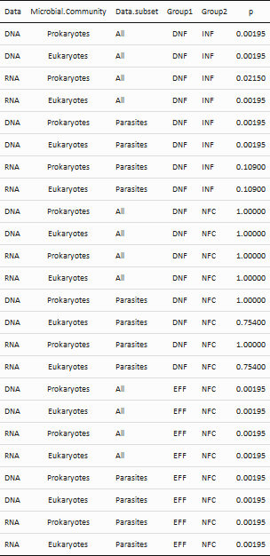
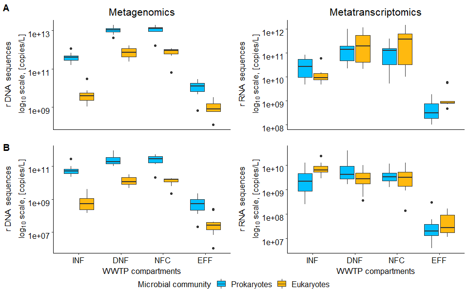

Total number of rDNA and rRNA sequences
================
Jule Freudenthal
2022-02-03

**R version:** 3.6.2 (2019-12-12), Dark and Stormy Night  
**Packages**

-   dplyr v. 1.0.7  
-   ggplot2 v. 3.3.5  
-   ggpubr v. 0.4.0  
-   kableExtra v. 1.3.4  
-   readxl v. 1.3.1  
-   reshape2 v. 1.4.4  
-   rlist v. 0.4.6.1  
-   rstatix v. 0.7.0

``` r
# Load packages
library(dplyr)
library(ggplot2)
library(ggpubr)
library(kableExtra)
library(readxl)
library(reshape2)
library(rlist)
library(rstatix)

# Load functions
source("./Functions/style.sheet.R")
```

We analyze changes in the total number of ribosomal sequences over time,
i.e. across the consecutive compartments, based on qPCR analysis for DNA
sequencing and spiked internal standards for RNA sequencing (RIS).

# 01 Summarize count data

First, we sum the non-rarefied counts per sample for the eukaryotes and
prokaryotes, as well as for the parasitic eukaryotes and prokaryotes,
respectively. We process metagenomic and metatranscriptomic data
separately.

``` r
# Load table with names of preprocessed count tables
filenames_count_tables <- read.table("./R/Lists/Preprocessing_data.csv", header = TRUE, 
                                     row.names = 1, sep = ";", colClasses = "character")

# Create open list for data.frames
summed_counts <- list()

# Loop iterates over the data types (DNA/RNA data)
for(data_type in c("DNA", "RNA")){
  
  # Load non rarefied count table 
  count_table <- read.table(paste0("./DataToAnalyse/PreprocessedData/", data_type, "_" , 
                                   filenames_count_tables[6,]), 
                            header = TRUE, sep = ";", dec = ".", row.names = 1)

  # Check for replicates
  if(any(grepl("ZR.R2|ZR.R3", colnames(count_table)))){
    # Delete ZR.R2 and ZR.R3 replicates in count data
    count_table <- count_table[,!grepl("ZR.R2|ZR.R3", colnames(count_table))]
    colnames(count_table) <- gsub("ZR.R1", "ZR", colnames(count_table))
    
    # Delete 'null' taxa
    count_table <- count_table[rowSums(select_if(count_table, is.numeric)) != 0,]
  }

  # Mark parasites
  load(paste0("./DataToAnalyse/RData/", data_type, "_data.rds"))
  taxonomy <- taxonomy[taxonomy$Traits == "parasite",]
  count_table <- data.frame(left_join(count_table, taxonomy))
  
  # Subset table for prokaryotes and eukaryotes
  count_tables <- lapply(c("SILVA", "PR2"), function(x) count_table[count_table$Database == x,])
  names(count_tables) <- c("Prokaryotes", "Eukaryotes")
  
  # Loop iterates over the microbial communities (prokaryotes/eukaryotes) 
  for(microbial_community in c("Prokaryotes", "Eukaryotes")){
    
    # Extract table
    count_table <- count_tables[[microbial_community]]
    
    # Extract counts
    count_table <- mutate_if(count_table, is.factor, as.character)
    counts <- select_if(count_table, is.numeric)
    
    # Sum counts per sample for all counts and parasitic counts respectively
    counts <- setNames(data.frame(colnames(counts), colSums(counts), 
                                  # Sums for parasites
                                  colSums(counts[which(count_table$Traits == "parasite"),])),
                       # Names
                       c("Samples", paste(microbial_community, data_type, "Reads_All", sep = "_"),
                         paste(microbial_community, data_type, "Reads_Parasites", sep = "_")))
  
    # Save tables in list
    summed_counts <- list.append(summed_counts, counts)
  }
}

# Merge all tables to one
summed_counts <- Reduce(function(...) merge(..., by = "Samples", all=T), summed_counts)  
```

# 02 Estimation of total counts

We estimate the total abundance of eukaryotic ribosomal sequences based
on the relative proportion of shotgun data in relation to the total
abundances of qPCR prokaryotic ribosomal sequences.

``` r
# Load supplementary DNA and RNA data with qPCR and RIS data
DNA <- read_excel("./DataToAnalyse/Metadata/Ju_F_et_al_2019_Supplementary_data.xlsx", 
                  sheet = "DNA", na = "NA")
RNA <- read_excel("./DataToAnalyse/Metadata/Ju_F_et_al_2019_Supplementary_data.xlsx", 
                  sheet = "RNA", na = "NA")

# Calculate total copies of prokaryotes for DNA data 
DNA$"Prokaryotes_DNA_TotalCopies_All" <- DNA$`IntI1/liter (qPCR)`/DNA$`IntI1/16S (qPCR)`

# Delete ZR.R2 and ZR.R3 replicates from RNA data
RNA <- RNA[!grepl("ZR1-R2|ZR1-R3", RNA$`Sample ID`),]

# Add column with sample IDs to both data sets
DNA$Samples <- paste(DNA$`WWTP ID`, DNA$Compartment, sep = "_")
RNA$Samples <- paste(RNA$`WWTP ID`, RNA$Compartment, sep = "_")

# Merge summed counts with qPCR and RIS data
total_counts <- left_join(summed_counts, 
                          merge(setNames(data.frame(DNA[,c("Samples", "Prokaryotes_DNA_TotalCopies_All")]), 
                                         c("Samples", "Prokaryotes_DNA_TotalCopies_All")),
                                setNames(data.frame(RNA[,c("Samples", "NF1 (copies/L)")]), 
                                         c("Samples", "NF1")), by = "Samples"), by = "Samples")

# Calculate the proportion of eukaryotic and prokaryotic reads, respectively (also for parasites) 
total_counts$`Prokaryotes_DNA_Reads_All_[%]` <- 
  total_counts$Prokaryotes_DNA_Reads_All/(total_counts$Prokaryotes_DNA_Reads_All + 
                                            total_counts$Eukaryotes_DNA_Reads_All)*100
total_counts$`Eukaryotes_DNA_Reads_All_[%]` <- 
  total_counts$Eukaryotes_DNA_Reads_All/(total_counts$Prokaryotes_DNA_Reads_All + 
                                           total_counts$Eukaryotes_DNA_Reads_All)*100
total_counts$`Prokaryotes_DNA_Reads_Parasites_[%]` <- 
  total_counts$Prokaryotes_DNA_Reads_Parasites/(total_counts$Prokaryotes_DNA_Reads_All + 
                                                  total_counts$Eukaryotes_DNA_Reads_All)*100
total_counts$`Eukaryotes_DNA_Reads_Parasites_[%]` <- 
  total_counts$Eukaryotes_DNA_Reads_Parasites/(total_counts$Prokaryotes_DNA_Reads_All + 
                                                 total_counts$Eukaryotes_DNA_Reads_All)*100

# Estimate the total rDNA reads
total_counts$Eukaryotes_DNA_TotalCopies_All <-
  total_counts$Prokaryotes_DNA_TotalCopies_All/total_counts$`Prokaryotes_DNA_Reads_All_[%]`*
  total_counts$`Eukaryotes_DNA_Reads_All_[%]`
total_counts$Prokaryotes_DNA_TotalCopies_Parasites <-
  total_counts$Prokaryotes_DNA_TotalCopies_All/total_counts$`Prokaryotes_DNA_Reads_All_[%]`*
  total_counts$`Prokaryotes_DNA_Reads_Parasites_[%]`
total_counts$Eukaryotes_DNA_TotalCopies_Parasites <-
  total_counts$Prokaryotes_DNA_TotalCopies_All/total_counts$`Prokaryotes_DNA_Reads_All_[%]`*
  total_counts$`Eukaryotes_DNA_Reads_Parasites_[%]`

# Estimate the total rRNA reads
total_counts$Prokaryotes_RNA_TotalCopies_All  <- total_counts$NF1 * total_counts$Prokaryotes_RNA_Reads_All
total_counts$Eukaryotes_RNA_TotalCopies_All <- total_counts$NF1 * total_counts$Eukaryotes_RNA_Reads_All
total_counts$Prokaryotes_RNA_TotalCopies_Parasites  <- total_counts$NF1 *
  total_counts$Prokaryotes_RNA_Reads_Parasites
total_counts$Eukaryotes_RNA_TotalCopies_Parasites <- total_counts$NF1 *
  total_counts$Eukaryotes_RNA_Reads_Parasites

# Assign compartments and locations to total counts
total_counts$Sample_places <- gsub(".*_", "", total_counts$Samples)
total_counts$Locations <- gsub("_.*", "", total_counts$Samples)
```

# 03 Sign test

We test for significant differences between the total abundance in the
inflow versus denitrification bioreactor, the denitrification versus
nitrification bioreactor, and the nitrification bioreactor versus the
outflow using sign test (function sign_test, package rstatix).

``` r
# Create open data frame
Sign_tests <- setNames(data.frame(matrix(ncol = 6, nrow = 0)), c("Data", "Microbial Community", 
                                                                 "Data subset", "Group1", "Group2", "p"))

# Loop iterates over the data types (DNA/RNA data) 
for(data_type in c("DNA", "RNA")){
  
  # Loop iterates over the microbial communities (prokaryotes/eukaryotes) 
  for(microbial_community in c("Prokaryotes", "Eukaryotes")){

    # Loop iterates over the whole and parasitic community 
    for(community in c("All", "Parasites")){
 
    # Subset table, only keep wanted data
    data <- total_counts[,grepl(paste(paste(microbial_community, data_type, "TotalCopies", community, 
                                            sep = "_"), "Sample_places", "Locations", sep = "|"), 
                                colnames(total_counts))]
    colnames(data) <- gsub(paste(microbial_community, data_type, "TotalCopies", community, sep = "_"),
                                "Counts", colnames(data))

    # Split data frame, keep only INF-DNF, DNF-NFC and NFC-EFF data respectively
    INF_DNF <- data[data$Sample_places %in% c("INF", "DNF"),]
    DNF_NFC <- data[data$Sample_places %in% c("DNF", "NFC"),]
    NFC_EFF <- data[data$Sample_places %in% c("NFC", "EFF"),]
    
    # Exclude samples with data for only one locations 
    INF_DNF <- INF_DNF[!INF_DNF$Location %in% names(which(table(INF_DNF$Location) != 2)),]
    DNF_NFC <- DNF_NFC[!DNF_NFC$Location %in% names(which(table(DNF_NFC$Location) != 2)),]
    NFC_EFF <- NFC_EFF[!NFC_EFF$Location %in% names(which(table(NFC_EFF$Location) != 2)),]
    
    # Sign test
    sign_test <- INF_DNF  %>% sign_test(Counts ~ Sample_places)
    Sign_tests <- rbind(Sign_tests, data.frame(Data = data_type, 
                                               `Microbial Community` = microbial_community,
                                               `Data subset` = community,
                                               Group1 = sign_test$group1, 
                                               Group2 = sign_test$group2, 
                                               p = sign_test$p))
    sign_test <- DNF_NFC  %>% sign_test(Counts ~ Sample_places)
    Sign_tests <- rbind(Sign_tests, data.frame(Data = data_type, 
                                               `Microbial Community` = microbial_community,
                                               `Data subset` = community,
                                               Group1 = sign_test$group1, 
                                               Group2 = sign_test$group2, 
                                               p = sign_test$p))
    sign_test <- NFC_EFF  %>% sign_test(Counts ~ Sample_places)
    Sign_tests <- rbind(Sign_tests, data.frame(Data = data_type, 
                                               `Microbial Community` = microbial_community,
                                               `Data subset` = community,
                                               Group1 = sign_test$group1, 
                                               Group2 = sign_test$group2, 
                                               p = sign_test$p))
    }
  }
}

# Order table
Sign_tests <- Sign_tests[order(Sign_tests$Group2, Sign_tests$Group1, Sign_tests$Data.subset, 
                               Sign_tests$Data, Sign_tests$Microbial.Community),]

# Delete row names
rownames(Sign_tests) <- NULL

# Visualise table
kable(Sign_tests, escape = F, booktabs = TRUE, align = "lclc") %>%
  kable_classic(full_width = F, html_font = "Calibri")  %>%
  kable_styling(font_size = 10, bootstrap_options = "condensed", position = "center", 
                latex_options = "scale_down") %>%
  save_kable("./R/Tables/SignTestTotalNumberOfSequences.png") 
```



# 04 Visualization

``` r
# Create open list for boxplots
boxplots <- list()

# Loop iterates over the whole and parasitic community 
for(community in c("All", "Parasites")){
  
  # Create open list for plots
  plots <- list()
  
  # Loop iterates over the data types (DNA/RNA data) 
  for(data_type in c("DNA", "RNA")){
 
    # Subset table, only keep wanted data
    plot_data <- total_counts[,grepl(paste(paste(data_type, "TotalCopies", community, sep = "_"), 
                                           "Sample_places", sep = "|"), colnames(total_counts))]
    colnames(plot_data) <- gsub(paste(data_type, community, "TotalCopies", "_", sep = "|"),
                                "", colnames(plot_data))
    
    # Format data for boxplots
    plot_data <- setNames(melt(plot_data, id=(c("Sampleplaces"))), 
                          c("Sample places", "Microbial community", "Reads"))
    
    # Basic plot
    plot <- ggplot(data = plot_data, aes(x=factor(`Sample places`, levels = c("INF", "DNF", "NFC", "EFF")), 
                           y=Reads, fill=`Microbial community`)) +
      geom_boxplot() + 
      scale_y_continuous(trans='log10') +
      theme_classic() +
      theme(plot.margin = margin(t = 10, l=5, r=5, b=0))
    
    # Adjust plot
    if(community == "All"){
      plot <- style.sheet(plot, x.axis.text.tick.marks = "", x.axis.label = "", 
                          y.axis.label = bquote(atop('r'~.(data_type)~' sequences', 
                                             log[10]~'scale, [copies/L]')), 
                          fill.colors = c("deepskyblue","darkgoldenrod1"), 
                          plot.title = ifelse(data_type == "DNA", "Metagenomics", "Metatranscriptomics")) 
    } else {
      plot <- style.sheet(plot, fill.colors = c("deepskyblue", "darkgoldenrod1"), 
                          x.axis.label = "WWTP compartments", 
                          y.axis.label = bquote(atop('r'~.(data_type)~' sequences', 
                                                     log[10]~'scale, [copies/L]'))) 
    }
    
    # Save plots in list
    plots <- list.append(plots, plot)
  }
  
  # Arrange subplots
  if(community == "All"){
    p <- ggarrange(plotlist=plots, ncol = 2, nrow=1, common.legend = TRUE, 
                   legend = "none")
    boxplots <- list.append(boxplots, p)
                            
  } else {
    p <- ggarrange(plotlist=plots, ncol = 2, nrow=1, common.legend = TRUE, 
                   legend = "bottom")
    boxplots <- list.append(boxplots, p)
  }
}

# Arrange all boxplots
figure <- ggarrange(plotlist=boxplots, ncol = 1, nrow=2, labels = c("A", "B"),
                    heights = c(1,1.1))
print(figure)
```



Boxplots showing the 25 % and 75 % percentiles and medians of the total
number of rDNA (metagenomics) and rRNA (metatranscriptomics) sequences
for (A) the total community and (B) the parasitic community, comparing
prokaryotes (blue) and eukaryotes (yellow).
