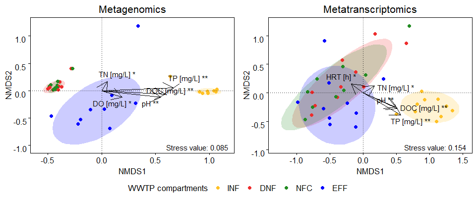

Microbial community structure and environmental factors across WWTPs
================
Jule Freudenthal
2022-02-03

**R version:** 3.6.2 (2019-12-12), Dark and Stormy Night  
**Packages**

-   docstring v. 1.0.0
-   ggplot2 v. 3.3.5  
-   ggpubr v. 0.4.0  
-   ggrepel v. 0.9.1  
-   mgsub v. 1.7.2  
-   rlist v. 0.4.6.1  
-   zeallot v. 0.1.0

``` r
# Load packages
library(docstring)
library(ggplot2)
library(ggpubr)
library(ggrepel)
library(mgsub)
library(rlist)
library(zeallot)

# Load functions
source("./Functions/calculate.NMDS.R")
source("./Functions/ordination.metadata.R")
source("./Functions/plot.NMDS.R")
source("./Functions/style.sheet.R")
source("./Functions/style.text.R")
```

To evaluate the influence of environmental factors on the WWTP microbial
community, we compute biplots based on Bray-Curtis dissimilarities for
the WWTPs as a whole, for both rDNA and rRNA relative abundance data
(function metaMDS, package vegan). We fit the environmental data
measured by [Ju et
al. (2019)](https://doi.org/10.1038/s41396-018-0277-8) (pH, dissolved
oxygen, dissolved organic carbon, total nitrogen, total phosphorus,
temperature, and hydraulic retention time) onto the ordinations using
envfit (vegan). We will correct the resulting p-values for multiple
testing according to Benjamini & Hochberg. Next, we scale (multiply)
significant environmental vectors with their correlation value and add
to the NMDS plots.

``` r
# Create vectors specifying the sample places and define colors per sample place
sample_places <- c("INF","DNF","NFC","EFF")
colors_sample_places <- c("goldenrod1", "firebrick2", "forestgreen", "blue")

# Create open list
plots <- list()

# Loop iterates over the data types (DNA/RNA data)
for(data_type in c("DNA", "RNA")){

  #----------------------------- Calculate NMDS -----------------------------#
  # Load count- and meta- and taxonomy data
  load(paste0("./DataToAnalyse/RData/", data_type, "_data.rds"))
  
  # Check if column names of the count data and row names of the metadata match
  if(!identical(colnames(counts), rownames(metadata))){
    stop("Row names of taxonomy and counts must match")
  }

  # Normalize counts (relative counts)
  normalized_counts <- sweep(x = counts, MARGIN = 2, STATS = colSums(counts), FUN = '/')

  # Calculate ordination
  NMDS <- calculate.NMDS(normalized_counts) 
  
  # Define title
  ifelse(data_type=="DNA", title <- "Metagenomics", title <- "Metatranscriptomics")
  
  # Visualization
  plot <- plot.NMDS(NMDS$Eigenvectors, group.attrib = metadata$Sample_Place, 
                    point.size = 2, draw.ellipse.by = "Group")

  # Adjust plot
  plot <- style.sheet(plot, colors = colors_sample_places, fill.colors = colors_sample_places, 
                      fill.colors.opacity = 0.2, legend.title.by.color = "WWTP compartments",
                      plot.title = title, legend.position = "bottom",
                      legend.text.by.color.order = sample_places, 
                      legend.text.by.fill.order = sample_places)

  # Add stress value
  plot <- plot + annotate("text", x=Inf,y=-Inf,hjust=1.1,vjust=-0.5,
                          label=paste("Stress value:", round(NMDS$StressValue,3)))

  #------------------------- Fit environmental data -------------------------#
  # Fit environmental data onto ordination
  c(environmental.vectors, environmental.factor) %<-% 
    ordination.metadata(metadata, ordination = NMDS$Ordination)
  
  # Keep only environmental vectors with p value < 0.05
  environmental.vectors <- environmental.vectors[environmental.vectors$p.values < 0.05,]
  
  # Check for significant environmental vectors
  if(nrow(environmental.vectors) != 0){
    # Change names of environmental factors
    environmental.vectors$Labels <- mgsub(row.names(environmental.vectors), 
                                          c("mg_per_L", "_C", "hours", "_"),
                                          c("[mg/L]", " [C]", "[h]", " "))
    
    # Format text, add stars to indicate significance
    environmental.vectors$Labels <- 
      style.text(names = environmental.vectors$Labels, p.values = environmental.vectors$p.values,
                 italic.text=rep(FALSE, nrow(environmental.vectors)))
    
    # Check if xlims and ylims are in range or if arrows are out of rang
    if(!all(environmental.vectors$x1 > layer_scales(plot)$x$range$range[1] & 
            environmental.vectors$x1 < layer_scales(plot)$x$range$range[2])){
      plot <- style.sheet(plot, xlims = c(min(c(environmental.vectors$x1, 
                                                layer_scales(plot)$x$range$range))*1.05, 
                                          max(c(environmental.vectors$x1, 
                                                layer_scales(plot)$x$range$range))*1.05))
    }
    if(!all(environmental.vectors$y1 > layer_scales(plot)$y$range$range[1] & 
            environmental.vectors$y1 < layer_scales(plot)$y$range$range[2])){
      plot <- style.sheet(plot, ylims = c(min(c(environmental.vectors$y1, 
                                                layer_scales(plot)$y$range$range))*1.05, 
                                          max(c(environmental.vectors$y1, 
                                                layer_scales(plot)$y$range$range))*1.05))
    }
    
    # Add arrows
    plot <- plot + geom_segment(data=environmental.vectors, aes(x=x0, y=y0, xend=x1, yend=y1),
                                inherit.aes = F, arrow=arrow(), color="black")
    plot <- plot + geom_text_repel(data=environmental.vectors, aes(x=x1, y=y1,label=Labels),
                                   inherit.aes = F, size=4, parse = T, force = T)
  }
  
  # Save plot in list
  plots <- list.append(plots , plot)
}

# Arrange plots
NMDS.plots <- ggarrange(plotlist=plots, ncol = 2, nrow=1, common.legend = TRUE, 
                        legend = "bottom")
print(NMDS.plots)
```



NMDS biplots show the microbial community composition across WWTP
compartments and locations, in association with environmental data.
Metagenomic and metatranscriptomic data are shown separately. Samples
are color-coded and grouped (ellipses) by compartment. Significant
environmental vectors are shown as arrows (\* p \< 0.05; \*\* p \< 0.01;
\*\*\* p \< 0.001). Environmental vectors: DO = dissolved oxygen, DOC =
dissolved organic carbon, HRT = Hydraulic retention time, TN = total
nitrogen, TP = total phosphorus.

This analysis shows that environmental factors such as pH, total
phosphorus and dissolved organic matter correlated significantly with
the diversity of the microbial community at the WWTP level.
